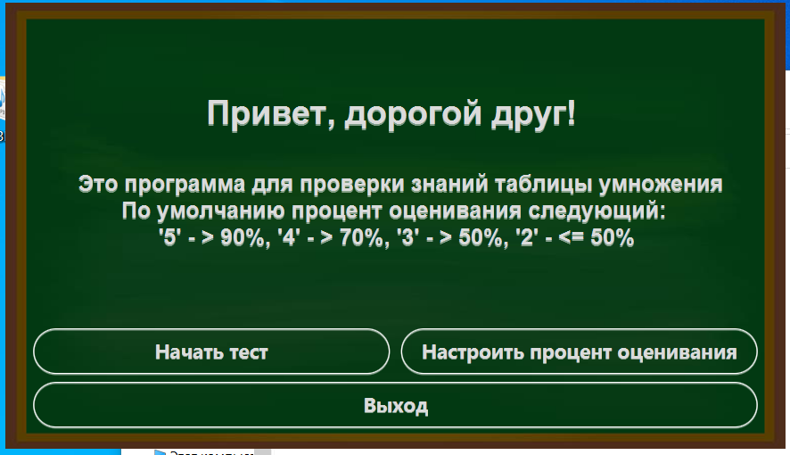
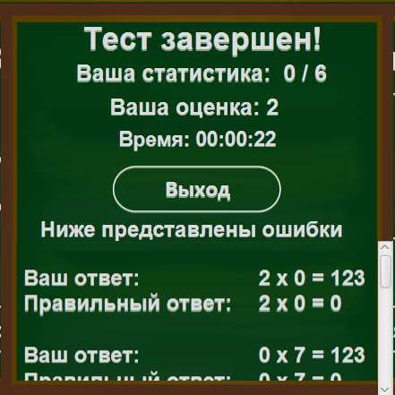

### О программе
Это десктопное приложение для проверки знаний таблицы умножения.

Данный проект написан на языке Java с использованием JavaFX и собран через Maven.
Это первое знакомство с JavaFX. При написании приложения не был использован Scene Builder.
***
### Системные требования
**Проверял только на своем ПК**

ОЗУ: 200МБ

Жеский диск: 40МБ (установочная папка)

ОС: Windows 10
***
### Как установить
В проекте имеется папка "Setup" с установочным файлом "setup.exe"
***
### Как запустить
После установки приложения запустить "Muliplication table.exe"
***
### Как пользоваться
Для использования приложения Вам потребуются мышка и клавиатура.

В стартовом меню Вы можете сразу начать тест, либо настроить процент оценивания.

При запуске теста Вам предлагается пример умножения однозначных чисел.
После ввода ответа в выделенное для этого окно, необходимо нажать кнопку "Принять", после чего пример изменится на новый.
Чтобы завершить тест, нужно нажать кнопку "Закончить".

Вам будет предоставлена статистика Ваших ответов, неправильные ответы, время выполнения теста и оценка по пятибальной системе.

